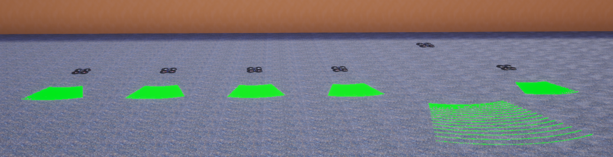
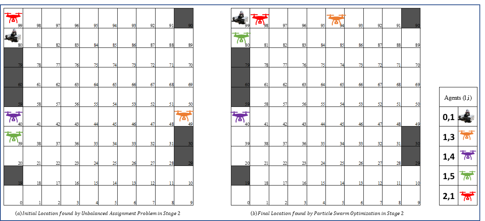
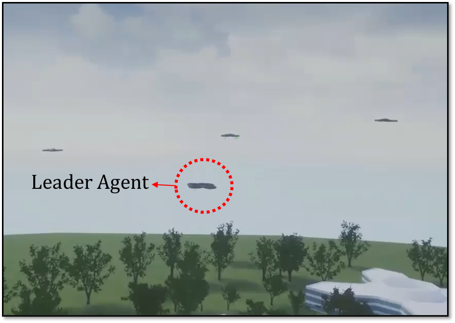
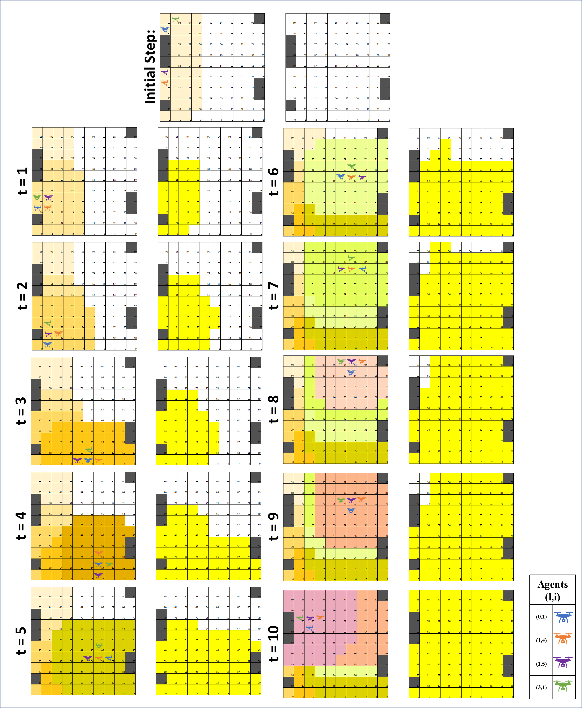
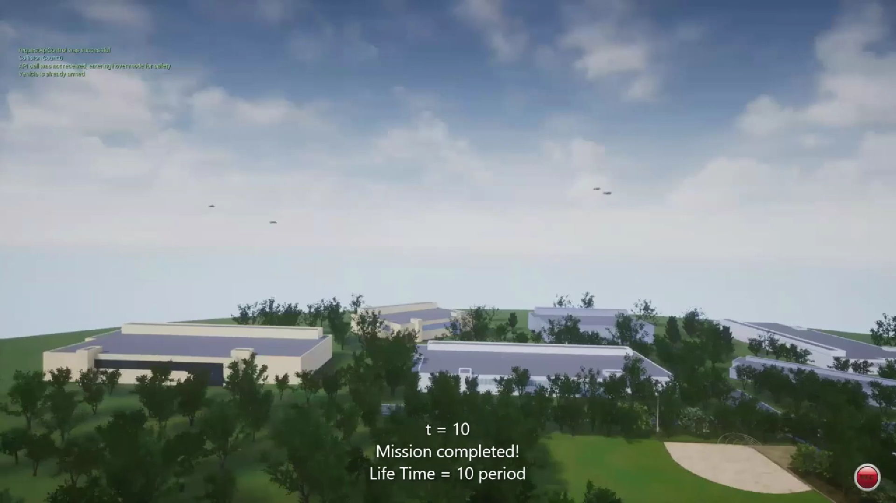

# Particle Swarm Optimization for Field Scanning Swarm Mission of Unmanned Aerial and Ground Vehicles

Today, the use of UAVs and UAVs is very important for the **early detection of 
increasing forest fires** and their response as soon as possible. 

In this project, the most suitable swarm members will be selected within the 
budget allocated for the area scanning task from the **UAVs** and **UGVs** in the 
inventory in order to scan the area, and the disaster 
area will be scanned as soon as possible without being centrally controlled 
(autonomously) with an **online algorithm**. 

Swarm members will be selected to be equipped to complete this task as soon 
as possible. Thus, scanning can be performed with minimum energy and cost. 

The online optimization model developed for field scanning will continue the 
scanning process in a way that can maintain the general purpose even if the 
swarm deviates to different routes. The online optimization model used here 
is particle swarm optimization.

This problem is divided into 4 sub-problems.

### Stage 1: Determination of the Swarm Agents

At this stage, it will be decided which unmanned aerial or ground vehicles 
will be included in the swarm.

### Stage 2: Determination of the Initial Entry Cells of the Agents

At this stage, the best entry cells for each agent to the target region will be decided in
order to form an initial connected swarm.

### Stage 3: Determination of the Swarm Leader

At this stage, it will be decided which unmanned aerial or ground vehicles 
will be included in the swarm.

### Stage 4: Energy-Aware Optimal Routing of the Swarm Agents

At this stage, it will be decided which unmanned aerial or ground vehicles 
will be included in the swarm.

### Simulation Video:

The above-mentioned 4 stages are modeled in AirSim simulation environment. 
In the example used for the calculation; The swarm, consisting 4 agents, 
scanned a 100x100 target area for a total of 10 periods, scanning each cell twice. 
The video below demonstrates the area scan process in a simulation of this 
example modeled in AirSim.

